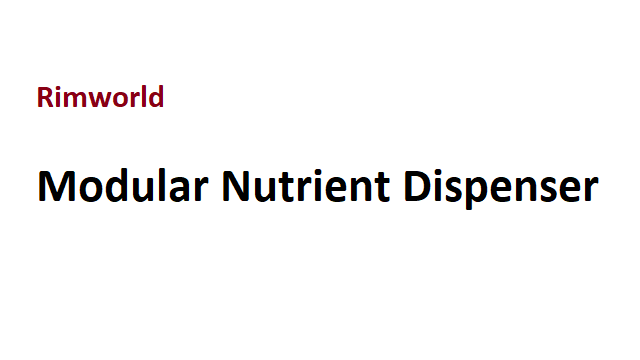

# Modular Nutrient Dispenser

[](#current-standing)
[](About/About.xml)
[](Source/Wolfsblvt.ModularNutrientDispenser/Wolfsblvt.ModularNutrientDispenser.csproj)

**A RimWorld experiment that turns the vanilla Nutrient Paste Dispenser into a buffered, extensible processor.**

While powered, the dispenser slowly pulls ingredients from adjacent hoppers and converts their nutrition into stored processed material. Colonists can draw meals from that reserve even while the building is unpowered. The code was written as a more generic base for configurable dispensers, but this repository stops at the vanilla-dispenser prototype.



## Current standing

> [!NOTE]
> This is a historical source snapshot, not a current Workshop release. The implementation on the default `develop` branch dates from June 2022, and the mod metadata declares support for RimWorld 1.3 only.

| | |
| --- | --- |
| **Game target** | RimWorld 1.3 |
| **Package ID** | `Wolfsblvt.ModularNutrientDispenser` |
| **Required mod** | Harmony (`brrainz.harmony`) |
| **Build target** | C# on .NET Framework 4.7.2 |
| **Distribution** | Source only; no compiled assembly or GitHub release is present |
| **Maintenance** | No current maintenance schedule, support promise, or newer-version compatibility is documented |

Despite the repository description mentioning “several addon buildings,” the current tree does not define additional buildings. Its concrete result is the reworked vanilla dispenser, the supporting stats, and the Harmony patches needed for RimWorld to recognize it.

## What the mod changes

The XML patch in [`Patches/Vanilla_Patches.xml`](Patches/Vanilla_Patches.xml) replaces the vanilla dispenser's class with `Building_ExtendableDispenser`, adds a configurable dispenser component, and gives the building three stats:

- processed-material capacity;
- raw material processed per in-game day; and
- the maximum material pulled in one processing step.

The C# implementation then:

1. accumulates processing capacity on rare ticks while the building has power;
2. pulls food from adjacent hoppers, preferring the smallest stack;
3. converts the ingredient's nutrition into an internal processed-material buffer;
4. dispenses nutrient paste from that buffer without requiring power; and
5. patches RimWorld's food-source checks so the derived dispenser class and its configurable output are recognized.

Developer-mode gizmos can fill or clear the buffer for testing. The source also records ingredient definitions for produced meals until the dispenser is cleaned.

## Build from source

### Prerequisites

The committed project files assume:

- a Windows Steam installation at the default `C:\Program Files (x86)\Steam\...` paths;
- RimWorld 1.3;
- Harmony from Steam Workshop item `2009463077`; and
- Visual Studio 2022 or another MSBuild setup with the .NET Framework 4.7.2 targeting pack.

The project uses direct references to RimWorld, Unity, and Harmony assemblies. If your installation lives elsewhere, update the three `<HintPath>` entries in [`Wolfsblvt.ModularNutrientDispenser.csproj`](Source/Wolfsblvt.ModularNutrientDispenser/Wolfsblvt.ModularNutrientDispenser.csproj) before building.

### Build

From a Visual Studio Developer Command Prompt at the repository root:

```powershell
msbuild Source\Wolfsblvt.ModularNutrientDispenser.sln /p:Configuration=Release
```

The main project is configured to write:

```text
Assemblies/Wolfsblvt.ModularNutrientDispenser.dll
```

You can also open [`Source/Wolfsblvt.ModularNutrientDispenser.sln`](Source/Wolfsblvt.ModularNutrientDispenser.sln) in Visual Studio and build the `Release` configuration.

### Load in RimWorld

Use the repository root as the mod directory, or copy `About/`, `Defs/`, `Patches/`, and the built `Assemblies/` directory into one RimWorld mod folder. Enable Harmony before Modular Nutrient Dispenser.

These instructions are derived from the committed metadata and project paths. They were not exercised against a RimWorld 1.3 installation during this documentation pass.

## Repository map

| Path | Purpose |
| --- | --- |
| [`About/`](About/) | RimWorld metadata and the original preview image |
| [`Defs/Stats/`](Defs/Stats/) | Custom building stats for buffer capacity and processing rate |
| [`Patches/`](Patches/) | XML changes applied to the vanilla Nutrient Paste Dispenser |
| [`Source/Wolfsblvt.ModularNutrientDispenser/`](Source/Wolfsblvt.ModularNutrientDispenser/) | Dispenser implementation, Harmony patches, and helpers |
| [`Source/Wolfsblvt.ModularNutrientDispenser.sln`](Source/Wolfsblvt.ModularNutrientDispenser.sln) | Visual Studio solution |
| [`Resources.csproj`](Resources.csproj) | Visual Studio project listing the mod's content folders |
| [`LICENSE.txt`](LICENSE.txt) | Committed software licence text |

## Known limitations

- The manifest names RimWorld 1.3 only. Compatibility with later versions is unknown.
- The Harmony integration inspects and rewrites RimWorld internals, including method IL, so game updates can break it even when the project still compiles.
- No compiled assembly, GitHub release, automated test project, or CI workflow is included.
- `About/About.xml` still contains a sample description rather than finished Workshop copy.
- The implementation emits warning-level logging on every rare dispenser tick and has not been qualified for ordinary play-session log volume.
- The processed buffer and pull budget are saved, but the set of ingredient definitions held in the buffer is not serialized; ingredient provenance after loading a save has not been verified.
- Despite the name, this is fictional game logic. It does not control physical dispensing hardware or make real-world food, nutrition, or medical claims.

## Credits

The committed mod metadata credits **Wolfsblvt** and **Primaeval** as authors.

## License

Distributed with an [MIT License](LICENSE.txt), which allows use, modification, and redistribution with the notice preserved; the committed copyright line still contains `[year] [fullname]` placeholders.
